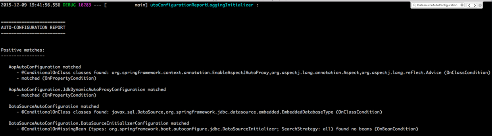
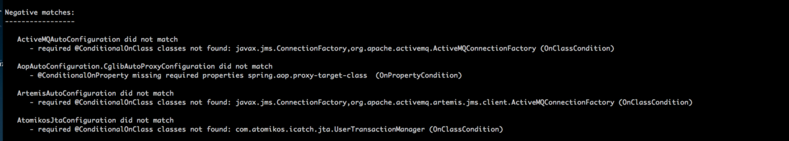

# 了解Spring Boot的自动配置

Spring Boot的自动配置给开发者带来了很大的便利，当开发人员在pom文件中添加starter依赖后，maven或者gradle会自动下载很多jar包到classpath中。当Spring Boot检测到特定类的存在，就会针对这个应用做一定的配置，自动创建和织入需要的spring bean到程序上下文中。

在之前的文章中，我们只是在pom文件中增加各种starter的依赖，例如：*spring-boot-starter-data-jpa, spring-boot-starter-web, spring-boot-starter-data-test*等等。接下来将在之前的工程的基础上，观察在程序的引导启动过程中，Spring Boot通过自动配置机制帮我们做了哪些工作。

## How Do

- Spring Boot启动时将自动配置的信息通过DEBUG级别的日志打印到控制台。可以通过设置环境变量（DEBUG）或者程序属性（--debug）设置程序的日志输出级别。
- 在项目目录下运行`DEBUG=true mvn spring-boot:run`启动应用程序；
- 在后台可以看到DEBUG级别的日志输出，在启动日志的最后，可以看到类似**AUTO-CONFIGURATION REPORT**的字样。





## 分析

可以看到，后台输出的自动配置信息特别多，好几页屏幕，没办法一一分析，在这里选择一个postive match和negative match进行分析。

Spring Boot通过配置信息指出：特定配置项被选中的原因、列出匹配到对应类的配置项（positive match）、不包括某个配置项的原因（negative match）。现在以*DataSourceAutoConfiguration*举例说明：
- *@ConditionalOnClass* 表示对应的类在classpath目录下存在时，才会去解析对应的配置文件，对于DataSourceAutoConfiguration来说就是指：只有javax.sql.DataSource和org.springframwork.jdbc.datasource.embedded.EmbeddedDatabaseType类都能存在时，就会配置对应的数据库资源。
- *@ConditionalOnMisssingClass*表示对应的类在classpath目录下找不到。
- *OnClassCondition*用于表示匹配的类型（postive or negative）

*OnClassCondition*是最普遍的浏览探测条件，除此之外，Spring Boot也使用别的探测条件，如：*OnBeanCondition*用于检测指定bean实例存在与否、*OnPropertyCondition*用于检查指定属性是否存在等等。

符合*negative match*代表一些配置类（xxxConfiguration之类的），它们虽然存在于classpath目录，但是修饰它们的注解中依赖的其他类不存在。导入如果在pom文件中导入*spring-boot-autoconfigure*包，则*GsonAutoConfiguration*就会出现在classpath目录下，但是该配置类被`@ConditionalOnClass(Gson.class)`修饰，而*com.google.gson.Gson*类不在classpath目录。

```
@Configuration
@ConditionalOnClass({Gson.class})
public class GsonAutoConfiguration {
    public GsonAutoConfiguration() {
    }

    @Bean
    @ConditionalOnMissingBean
    public Gson gson() {
        return new Gson();
    }
}
```

## 总结

- @ConditionalOnClass：该注解的参数对应的类必须存在，否则不解析该注解修饰的配置类；
- @ConditionalOnMissingBean：该注解表示，如果存在它修饰的类的bean，则不需要再创建这个bean；可以给该注解传入参数例如`@ConditionOnMissingBean(name = "example")`，这个表示如果name为“example”的bean存在，这该注解修饰的代码块不执行。

## 参考资料

1. [Spring Boot实战：自动配置原理分析](http://blog.csdn.net/liaokailin/article/details/49559951)
