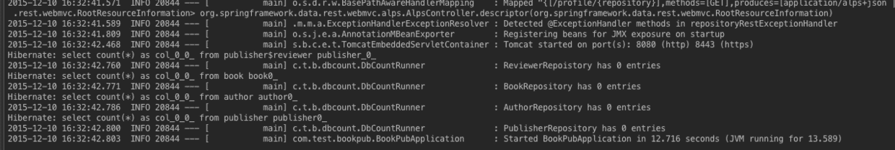

# Spring Boot：定制自己的starter

在学习Spring Boot的过程中，接触最多的就是starter。可以认为starter是一种服务——使得使用某个功能的开发者不需要关注各种依赖库的处理，不需要具体的配置信息，由Spring Boot自动通过classpath路径下的类发现需要的Bean，并织入bean。举个例子，*spring-boot-starter-jdbc*这个starter的存在，使得我们只需要在BookPubApplication下用`@Autowired`引入DataSource的bean就可以，Spring Boot会自动创建DataSource的实例。

这里我们会用一个不太规范的starter展示Spring Boot的自动配置的运行原理。[Spring Boot的自动配置、Command-line Runner](spring-boot-autoconfig.md)一文中曾利用StartupRunner类在程序运行启动后首先查询数据库中书的数目，现在换个需求：*在系统启动后打印各个实体的数量*。

## How Do

- 新建一个模块*db-count-starter*，然后修改db-count-starter模块下的pom文件，增加对应的库。

```
<dependencies>
    <dependency>
        <groupId>org.springframework.boot</groupId>
        <artifactId>spring-boot</artifactId>
        <!-- version继承父模块的-->
    </dependency>
    <dependency>
        <groupId>org.springframework.data</groupId>
        <artifactId>spring-data-commons</artifactId>
        <version>1.9.3.RELEASE</version>
    </dependency></dependencies>
```

- 新建包结构*com/test/bookpubstarter/dbcount*，然后新建DbCountRunner类，实现CommandLineRunner接口，在run方法中输出每个实体的数量。

```
package com.test.bookpubstarter.dbcount;

import org.slf4j.Logger;
import org.slf4j.LoggerFactory;
import org.springframework.boot.CommandLineRunner;
import org.springframework.data.repository.CrudRepository;
import java.util.Collection;

public class DbCountRunner implements CommandLineRunner {
    protected final Logger logger = LoggerFactory.getLogger(DbCountRunner.class);
    private Collection<CrudRepository> repositories;

    public DbCountRunner(Collection<CrudRepository> repositories) {
        this.repositories = repositories;
    }
    @Override
    public void run(String... strings) throws Exception {
        repositories.forEach(crudRepository -> {
            logger.info(String.format("%s has %s entries",
                    getRepositoryName(crudRepository.getClass()),
                    crudRepository.count()));
        });
    }

    private static String getRepositoryName(Class crudRepositoryClass) {
        for (Class repositoryInterface : crudRepositoryClass.getInterfaces()) {
            if (repositoryInterface.getName().startsWith("com.test.bookpub.repository")) {
                return repositoryInterface.getSimpleName();
            }
        }
        return "UnknownRepository";
    }
}
```

- 增加自动配置文件*DbCountAutoConfiguration*

```
package com.test.bookpubstarter.dbcount;
import org.springframework.context.annotation.Bean;
import org.springframework.context.annotation.Configuration;
import org.springframework.data.repository.CrudRepository;
import java.util.Collection;

@Configuration
public class DbCountAutoConfiguration {
    @Bean
    public DbCountRunner dbCountRunner(Collection<CrudRepository> repositories) {
        return new DbCountRunner(repositories);
    }
}
```

- 在src/main/resources目录下新建META-INF文件夹，然后新建*spring.factories*文件，这个文件用于告诉Spring Boot去找指定的自动配置文件，因此它的内容是

```
org.springframework.boot.autoconfigure.EnableAutoConfiguration=\
com.test.bookpubstarter.dbcount.DbCountAutoConfiguration
```

- 在之前的程序基础上，在顶层pom文件中增加starter的依赖

```
<dependency>
   <groupId>com.test</groupId>
   <artifactId>db-count-starter</artifactId>
   <version>0.0.1-SNAPSHOT</version>
</dependency>
```

- 把StartupRunner相关的注释掉，然后在main函数上右键*Run BookPubApplication.main(...)*，可以看出我们编写的starter被主程序使用了。



## 分析

正规的starter是一个独立的工程，然后在maven中新仓库注册发布，其他开发人员就可以使用你的starter了。

常见的starter会包括下面几个方面的内容：

1. 自动配置文件，根据classpath是否存在指定的类来决定是否要执行该功能的自动配置。
2. spring.factories，非常重要，指导Spring Boot找到指定的自动配置文件。
3. endpoint：可以理解为一个admin，包含对服务的描述、界面、交互（业务信息的查询）
4. health indicator：该starter提供的服务的健康指标

在应用程序启动过程中，Spring Boot使用*SpringFactoriesLoader*类加载器查找*org.springframework.boot.autoconfigure.EnableAutoConfiguration*关键字对应的Java配置文件。Spring Boot会遍历在各个jar包种META-INF目录下的*spring.factories*文件，构建成一个配置文件链表。除了*EnableAutoConfiguration*关键字对应的配置文件，还有其他类型的配置文件：

- org.springframework.context.ApplicationContextInitializer
- org.springframework.context.ApplicationListener 
- org.springframework.boot.SpringApplicationRunListener 
- org.springframework.boot.env.PropertySourceLoader 
- org.springframework.boot.autoconfigure.template.TemplateAvailabilityProvider
- org.springframework.test.contex.TestExecutionListener

Spring Boot的starter在编译时不需要依赖Spring Boot的库。这个例子中依赖spring boot并不是因为自动配置要用spring boot，而仅仅是因为需要实现*CommandLineRunner*接口。

## 两个需要注意的点

1. *@ConditionalOnMissingBean*的作用是：只有对应的ban在系统中都没有被创建，它修饰的初始化代码块才会执行，**用户自己手动创建的bean优先**；

2. Spring Boot starter如何找到自动配置文件（xxxxAutoConfiguration之类的文件）？
 - spring.factories：由*Spring Boot触发*探测classpath目录下的类，进行自动配置；
 - @Enable*：有时需要由starter的*用户触发*查找自动配置文件的过程。
