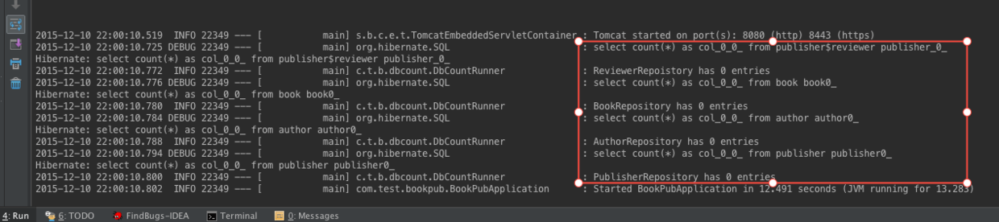

# 通过@Enable*注解触发Spring Boot配置

在[Spring Boot：定制自己的starter](http://www.jianshu.com/p/85460c1d835a)一文最后提到，触发Spring Boot的配置过程有两种方法：
>1. spring.factories：由*Spring Boot触发*探测classpath目录下的类，进行自动配置；
2.  @Enable*：有时需要由starter的*用户触发*查找自动配置文件的过程。

## How Do

- 接着上篇文章的例子，首先将*spring.factories*中的内容注释掉

```
#org.springframework.boot.autoconfigure.EnableAutoConfiguration=\
#com.test.bookpubstarter.dbcount.DbCountAutoConfiguration
```

- 创建元注解（meta-annotation），即在db-count-starter/src/main/java/org/test/bookpubstarter/dbcount目录下新建EnableDbCounting.java文件。

```
package com.test.bookpubstarter.dbcount;

import org.springframework.context.annotation.Import;
import java.lang.annotation.*;

@Target(ElementType.TYPE)
@Retention(RetentionPolicy.RUNTIME)
@Import(DbCountAutoConfiguration.class)
@Documented
public @interface EnableDbCounting {
}
```

- 在BookPubApplication类中删去之前手动创建的DbCountRunner的spring bean，然后用*@EnableDbCounting*注解修饰BookPubApplication类。

```
package com.test.bookpub;

import com.test.bookpubstarter.dbcount.EnableDbCounting;
import org.springframework.boot.SpringApplication;
import org.springframework.boot.autoconfigure.SpringBootApplication;

@SpringBootApplication
@EnableDbCounting
public class BookPubApplication {
    public static void main(String[] args) {
        SpringApplication.run(BookPubApplication.class, args);
    }
}
```

- 启动应用程序，设置日志级别为DEBUG



可以看出我们自己定义的注解起作用了。如果没有spring.factories，那么在程序启动的时候Spring Boot的自动配置机制不会试图解析*DbCountAutoConfiguration*类。一般来说，@Component注解的作用范围就是在BookPubApplication所在的目录以及各个子目录，即com.test.bookpub.*，而DbCountAutoConfiguration是在org.test.bookpubstarter.dbcount目录下，因此不会被扫描到。

*@EnableDbCounting*注解通过*@Import(DbCountAutoConfiguration.class)*找到对应的配置类，因此通过用@EnableDbCounting修饰BookPubApplication，就是告诉Spring Boot在启动过程中要把DbCountAutoConfiguration加入到应用上下文中。
