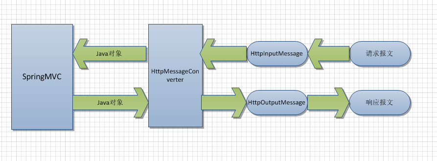

# Spring Boot：定制HTTP消息转换器

在构建RESTful数据服务过程中，我们定义了controller、repositories，并用一些注解修饰它们，但是到现在为止我们还没执行过对象的转换——将java实体对象转换成HTTP的数据输出流。Spring Boot底层通过*HttpMessageConverters*依靠Jackson库将Java实体类输出为JSON格式。当有多个转换器可用时，根据消息对象类型和需要的内容类型选择最适合的转换器使用。

在[SpringMVC源码剖析（五)-消息转换器HttpMessageConverter](http://my.oschina.net/lichhao/blog/172562)一文中，有一张图可以很清楚得表示消息转换器的位置。



消息转换器的目标是：HTTP输入请求格式向Java对象的转换；Java对象向HTTP输出请求的转换。有的消息转换器只支持多个数据类型，有的只支持多个输出格式，还有的两者兼备。例如：*MappingJackson2HttpMessageConverter*可以将Java对象转换为application/json，而*ProtobufHttpMessageConverter*仅支持*com.google.protobuf.Message*类型的输入，但是可以输出application/json、application/xml、text/plain和application/x-protobuf这么多格式。

## How Do

在项目中有三种办法配置消息转换器，主要区别是*可定制性*和*易用度*的衡量。
1. 在WebConfiguration类中加入@Bean定义

```
@Beanpublic ByteArrayHttpMessageConverter byteArrayHttpMessageConverter() {
    return new ByteArrayHttpMessageConverter();
}
```

2. 重写（override）*configureMessageConverters*方法，扩展现有的消息转换器链表；

```
@Overridepublic 
void configureMessageConverters(List<HttpMessageConverter<?>> converters) {
    converters.add(new ByteArrayHttpMessageConverter());
}
```

3. 更多的控制，可以重写*extendMessageConverters*方法，首先清空转换器列表，再加入自定义的转换器。

```
@Overridepublic 
void extendMessageConverters(List<HttpMessageConverter<?>> converters) {
    converters.clear();
    converters.add(new ByteArrayHttpMessageConverter());
}
```

## 分析

Spring提供了多种方法完成同样的任务，选择哪个取决于我们更侧重便捷性还是更侧重可定制性。

上述提到的三种方法各有什么不同呢？

通过*@Bean*定义*HttpMessageConverter*是向项目中添加消息转换器最简便的办法，这类似于之前提到的添加Servlet Filters。如果Spring扫描到HttpMessageConverter类型的bean，就会将它自动添加到调用链中。推荐让项目中的WebConfiguration继承自WebMvcConfigurerAdapter。

通过重写*configureMessageConverters*方法添加自定义的转换器很方便，但有一个弱点：如果项目中存在多个WebMvcConfigurers的实例（我们自己定义的，或者Spring Boot默认提供的），不能确保重写后的configureMessageConverters方法按照固定顺序执行。

如果需要更精细的控制：清除其他消息转换器或者清楚重复的转换器，可以通过重写*extendMessageConverters*完成，仍然有这种可能：别的WebMvcConfigurer实例也可以重写这个方法，但是这种几率非常小。
