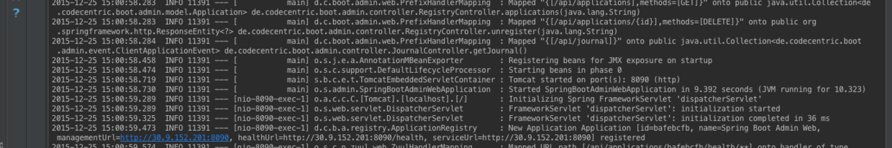
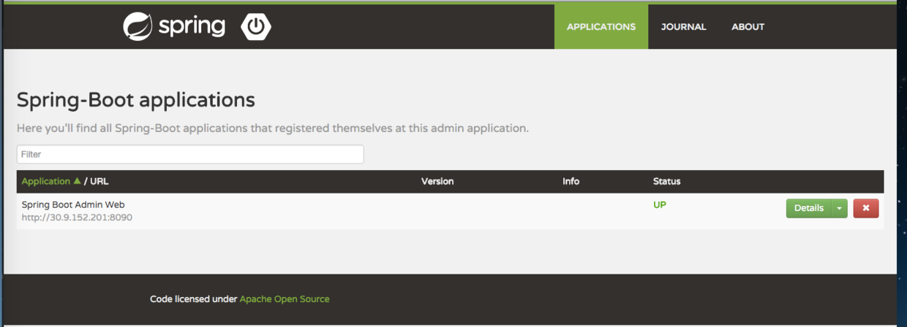
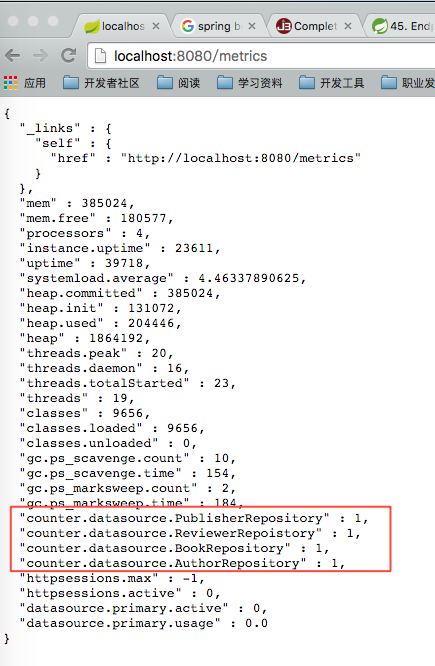
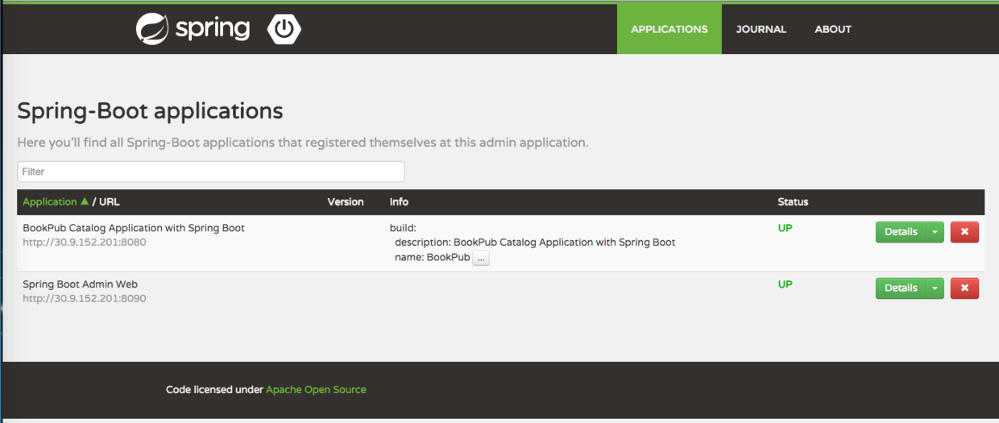
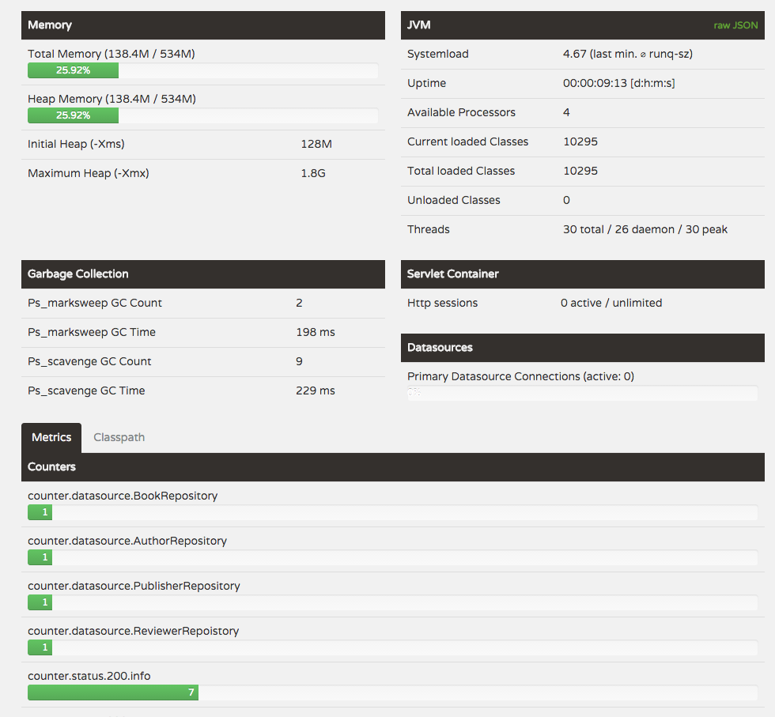
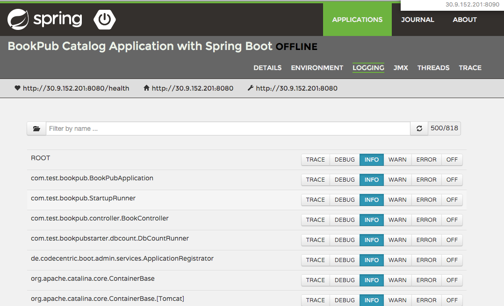
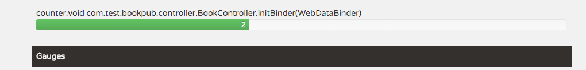
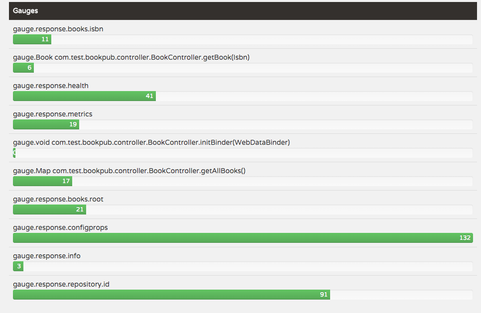

# Spring Boot Admin的使用

上一篇文章中了解了Spring Boot提供的监控接口，例如：/health、/info等等，实际上除了之前提到的信息，还有其他信息业需要监控：当前处于活跃状态的会话数量、当前应用的并发数、延迟以及其他度量信息。这次我们了解如何利用Spring-boot-admin对应用信息进行可视化，如何添加度量信息。

## 准备

spring-boot-admin的Github地址在：[https://github.com/codecentric/spring-boot-admin](https://github.com/codecentric/spring-boot-admin)，它在Spring Boot Actuator的基础上提供简洁的可视化WEB UI。

- 首先在[start.spring.io](http://start.spring.io/)中创建简单的admin应用，主要步骤如下：
  - **Group:** org.sample.admin
  - **Artifact:** spring-boot-admin-web
  - **Name:** Spring Boot Admin Web
  - **Description:** Spring Boot Admin Web Application
  - **Package Name:** org.sample.admin
  - **Type: ** Maven Project
  - **Packaging:** Jar
  - **Java Version:** 1.8
  - **Language:** Java
  - **Spring Boot Version:** 1.3.1
- 在**Ops**组选项中选择**Actuator**
- 选择**Generate Project**下载应用
- 使用IDEA打开工程，在pom.xml文件中添加下列依赖

```
<dependency>
   <groupId>de.codecentric</groupId>
   <artifactId>spring-boot-admin-server</artifactId>
   <version>1.3.2</version>
</dependency>
<dependency>
   <groupId>de.codecentric</groupId>
   <artifactId>spring-boot-admin-server-ui</artifactId>
   <version>1.3.2</version>
</dependency>
```

- 在*SpringBootAdminWebApplication.java*文件中添加*@EnableAdminServer*注解

```
@SpringBootApplication
@EnableAdminServer
public class SpringBootAdminWebApplication {
    public static void main(String[] args) {
        SpringApplication.run(SpringBootAdminWebApplication.class, args);
    }
}
```

- 在application.properties文件中添加如下配置

```
server.port = 8090
spring.application.name=Spring Boot Admin Web
spring.boot.admin.url=http://localhost:${server.port}
spring.jackson.serialization.indent_output=true
endpoints.health.sensitive=false
```

- 启动应用程序，在后台给定如下提示：

- 在浏览器中访问上图中提示的地址，可以看到下图的信息


## How Do

- 启动Admin Web应用后，现在可以添加针对BookPub应用的度量信息了。在文章[Spring Boot应用的健康监控](http://www.jianshu.com/p/734519d3c383)中，我们曾定制自己的Health Indicator，用来监控四个数据库接口的健康状态，这次我将利用spring-boot-admin对这些信息进行可视化管理。
- 在db-count-starter模块下添加代码，首先在*db-count-starter/src/main/java/com/test/bookpubstarter/dbcount*目录下添加*DbCountMetrics*类：

```
public class DbCountMetrics implements PublicMetrics {
    private Collection<CrudRepository> repositories;
    public DbCountMetrics(Collection<CrudRepository> repositories) {
        this.repositories = repositories;
    }
    @Override
    public Collection<Metric<?>> metrics() {
        List<Metric<?>> metrics = new LinkedList<>();
        for (CrudRepository repository: repositories) {
            String name =
 DbCountRunner.getRepositoryName(repository.getClass());
            String metricName = "counter.datasource." + name;
            metrics.add(new Metric(metricName, repository.count()));
        }
        return metrics;
    }
}
```

- 在*DbCountAutoConfiguration*定义对应的Bean，由Spring Boot完成自动注册

```
@Bean
public PublicMetrics dbCountMetrics(Collection<CrudRepository> repositories) {
    return new DbCountMetrics(repositories);
}
```

- 启动BookPub应用，访问*http://localhost:8080/metrics*，可以看到*DbCountMetrics*已经添加到metrics列表中了。

- 在db-count-starter模块下的pom文件中添加*spring-boot-admin-starter-client*依赖，

```
<dependency>
    <groupId>de.codecentric</groupId>
    <artifactId>spring-boot-admin-starter-client</artifactId>
    <version>1.3.2</version>
</dependency>
```

- 在BookPub应用下的application.properties中配置下列属性值

```
spring.application.name=@project.description@
server.port=8080
spring.boot.admin.url=http://localhost:8090
```

- 启动BookPub应用，然后在浏览器中访问*http://localhost:8090*

- 点击右侧的“Details”，可以看到该应用的详细信息


## 分析

Spring Boot Admin就是将Spring Boot Actuator中提供的endpoint信息可视化表示，在BookPub应用（被监控）的这一端，只需要进行一点配置即可。
- spring-boot-admin-starter-client，作为客户端，用于与Spring Boot Admin Web的服务器沟通；
- spring.boot.admin.url=http:localhost:8090用于将当前应用注册到Spring Boot Admin。

如果希望通过Web控制系统的日志级别，则需要在应用中添加Jolokia JMX库（org.jolokia:jolokia-core），同时在项目资源目录下添加logback.xml文件，内容如下：

```
<configuration>
    <include resource="org/springframework/boot/logging/logback/base.xml"/>
    <jmxConfigurator/>
</configuration>
```

然后再次启动BookPub应用，然后在Spring Boot Admin的页面中查看LOGGING，则可以看到如下页面：


Spring Boot提供的度量工具功能强大且具备良好的扩展性，除了我们配置的DbCountMetrics，还监控BookPub应用的其他信息，例如内存消耗、线程数量、系统时间以及http会话数量。

## gague和counter的定制

gague和counter度量通过*GagueService*和*CountService*实例提供，这些实例可以导入到任何Spring管理的对象中，用于度量应用信息。例如，我们可以统计某个方法的调用次数，如果要统计所有RESTful接口的调用次数，则可以通过AOP实现，在调用指定的接口之前，首先调用*counterService.increment("objectName.methodName.invoked");*，某个方法被调用之后，则对它的统计值+1。具体的实验步骤如下：
- 在pom文件中添加AOP依赖

```
<dependency>
   <groupId>org.springframework.boot</groupId>
   <artifactId>spring-boot-starter-aop</artifactId>
</dependency>
```

- 在BookPub应用中添加Aspect组件，表示在每个Controller的方法调用之前，首先增加调用次数。

```
@Aspect
@Component
public class ServiceMonitor {
    @Autowired
    private CounterService counterService;
    @Before("execution(* com.test.bookpub.controller.*.*(..))")
    public void countServiceInvoke(JoinPoint joinPoint) {
        counterService.increment(joinPoint.getSignature() + "");
    }
}
```

- 在application.properties中设置打开AOP功能：`spring.aop.auto=true`
然后启动BookPub应用，通过浏览器访问`http://localhost:8080/books/9876-5432-1111`，然后再去Spring Boot Admin后台查看对应信息，发现该方法的调用次数已经被统计好了


如果希望统计每个接口的调用时长，则需要借助GagueService来实现，同样使用AOP实现，则需要环绕通知：在接口调用之前，利用*long start = System.currentTimeMillis();*，在接口调用之后，计算耗费的时间，单位是ms，然后使用*gugeService.submit(latency)*更新该接口的调用延时。
- 在*ServiceMonitor*类中添加对应的监控代码

```
@Autowired
private GaugeService gaugeService;
@Around("execution(* com.test.bookpub.controller.*.*(..))")
public void latencyService(ProceedingJoinPoint pjp) throws Throwable {
    long start = System.currentTimeMillis();
    pjp.proceed();
    long end = System.currentTimeMillis();
    gaugeService.submit(pjp.getSignature().toString(), end - start);
}
```

- 然后在Spring Boot Admin后台可以看到对应接口的调用延迟


这两个service可以应付大多数应用需求，如果需要监控其他的度量信息，则可以定制我们自己的Metrics，例如在之前的例子中我们要统计四个数据库接口的调用状态，则我们定义了*DbCountMetrics*，该类实现了*PublishMetrics*，在这个类中我们统计每个数据库接口的记录数量。

*PublishMetrics*这个接口只有一个方法：*Collection<Metric<?>> metrics();*，在该方法中定义具体的监控信息；该接口的实现类需要在配置文件中通过@Bean注解，让Spring Boot在启动过程中初始化，并自动注册到*MetricsEndpoint*处理器中，这样每次有访问*/metrics*的请求到来时，就会执行对应的metrics方法。

## 参考资料

1. [Chapter 6. 使用Spring进行面向切面编程（AOP）](http://shouce.jb51.net/spring/aop.html)
