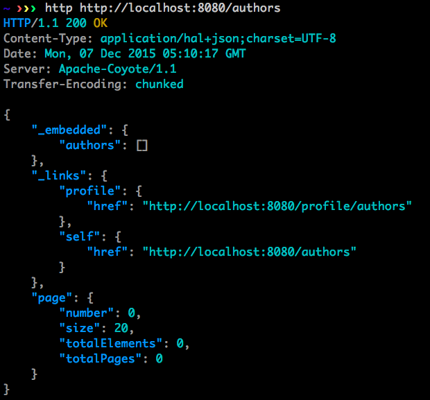

# Spring Boot: Data Rest Service

在文章[RESTful by Spring Boot with MySQL](spring-boot-rest-mysql.md)通过在Controller中引入BookRepository来对外提供REST API。Spring Boot还可以通过`spring-boot-starter-data-rest`来对外提供REST API，可以免于编写对应的Controller，且具备分页和排序的功能。

## 实践

- 在pom文件中添加依赖项

```
<dependency>
     <groupId>org.springframework.boot</groupId>      
     <artifactId>spring-boot-starter-data-rest</artifactId>
</dependency>
```

- 在包com.test.bookpub.repository下创建AuthorRepository接口，该接口继承自PagingAndSortingRepository，并用@RepositoryRestResource注解修饰。代码如下：

```
package com.test.bookpub.repository;

import com.test.bookpub.domain.Author;
import org.springframework.data.repository.PagingAndSortingRepository;
import org.springframework.data.rest.core.annotation.RepositoryRestResource;

@RepositoryRestResource
public interface AuthorRepository
 extends PagingAndSortingRepository<Author, Long> {
}
```

- 可以看出，实际编写的代码很少，同样套路，为Publisher和Reviewer也添加类似的接口。
PublisherRepository的代码如下：

```
package com.test.bookpub.repository;

import com.test.bookpub.domain.Publisher;
import org.springframework.data.repository.PagingAndSortingRepository;
import org.springframework.data.rest.core.annotation.RepositoryRestResource;

@RepositoryRestResourcepublic
interface PublisherRepository
    extends PagingAndSortingRepository<Publisher, Long> {
}
```

ReviewerRepository的代码如下：

```
package com.test.bookpub.repository;
import org.springframework.data.repository.PagingAndSortingRepository;
import com.test.bookpub.domain.Publisher.Reviewer;
import org.springframework.data.rest.core.annotation.RepositoryRestResource;

@RepositoryRestResourcepublic interface ReviewerRepoistory
    extends PagingAndSortingRepository<Reviewer, Long> {
}
```

- 启动应用程序，并访问`http://localhost:8080/authors`，将会得到如下结果


## 分析

显然，通过继承PagingAndSortingRepository接口，比直接写Controller能提供更多的功能：分页查询和对查询结果排序。

@RepositoryRestResource注解让编程人员可以直接通过repository提供数据接口，在这个“前端负责V和C，后端负责提供数据”的时代，非常方便；并且，可以通过给该注解传入参数来改变URL。

只要在项目的classpath中包含spring-boot-starter-data-rest，同时就包含了spring-hateoas库支持，这个库可以提供[ALPS元数据](https://spring.io/blog/2014/07/14/spring-data-rest-now-comes-with-alps-metadata)——一种数据格式，可以用于描述应用级别的API语义。

## 参考资料：

1. [ALPS主页](http://alps.io/spec/index.html)
2. [Spring Data Rest + Spring Secuirty](http://docs.spring.io/spring-data/rest/docs/current/reference/html/#spring-data-examples.spring-security)
