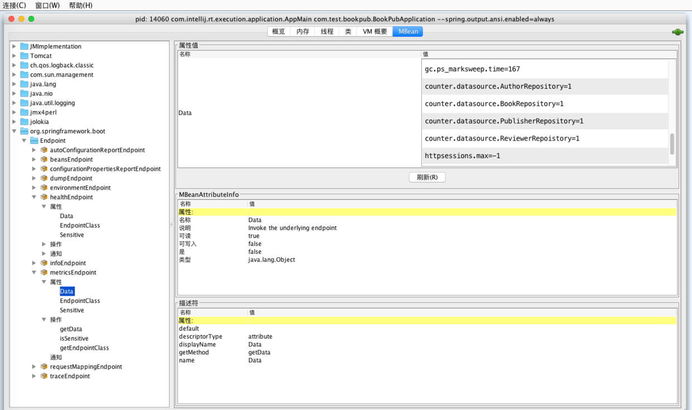
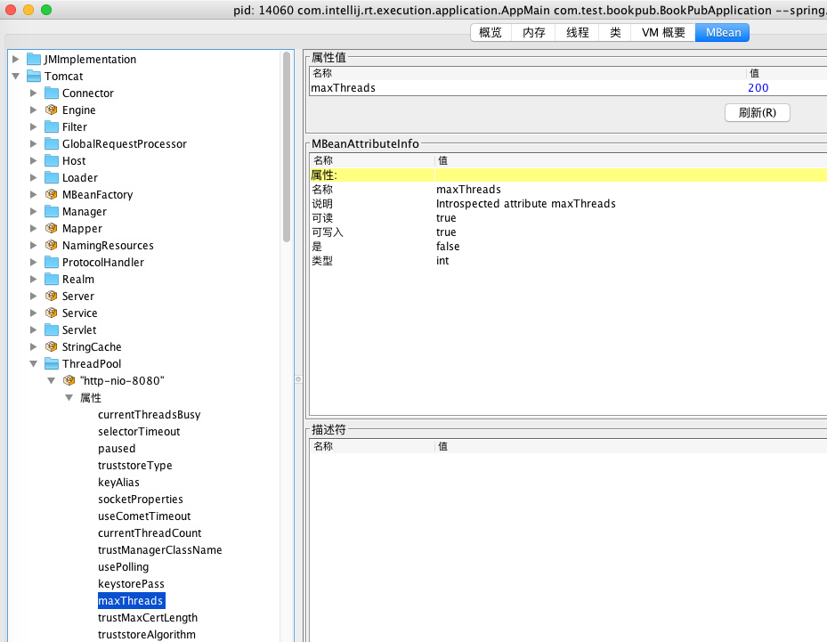
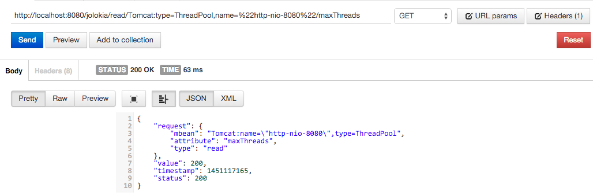

# 通过JMX监控Spring Boot应用

在[Spring Boot应用的健康监控](http://www.jianshu.com/p/734519d3c383)一文中，我们通过Spring Boot Actuator对外暴露应用的监控信息，除了使用HTTP获取JSON格式 的数据之外，还可以通过JMX监控应用，Spring Boot也提供了对JMX监控的支持。JMX监控对外暴露的信息相同，不过是使用MBeans容器将应用数据封装管理。

接下来我们看下如何利用JMX获取应用状态信息，以及如何使用Jolokia JMX库对外暴露MBeans的HTTP访问URL。

## Get Ready

在BookPub应用的pom文件中添加jolokia-core依赖

```
<!-- JMX monitor -->
<dependency>
   <groupId>org.jolokia</groupId>
   <artifactId>jolokia-core</artifactId>
</dependency>
```

## How Do

1. 启动BookPub应用，然后在命令行中执行`jconsole`命令启动“Java管理和监视控制台”，然后选择*org.springframework.boot*节点下的*Endpoint*，可以看到如下信息


2.  在*Tomcat*节点下选择*ThreadPool*，然后在选择*http-nio-8080*节点，在这个节点下选择maxThreads属性，可以看到如下信息


3. 除了通过JMX获取信息，也暴露了对应的HTTP接口访问Mbeans对象的信息，例如，我们在postman中访问*http://localhost:8080/jolokia/read/Tomcat:type=ThreadPool,name=%22http-nio-8080%22/maxThreads*，也可以得到对应的信息


## 分析

只要添加了Spring Boot Actuator库，所有相关的endpoint和管理服务都打开了，包括JMX，我们可以通过设置*endpoints.jmx.enabled=false*禁止对外提供基于JMX的endpoints；或者通过设置*spring.jmx.enabled=false*禁止对外提供Spring MBeans。

在类路径中存在的Jolokia库会触发Spring Boot的*JolokiaAutoConfiguration*，这个自动配置类会自动配置可以接受*/jolokia*请求的*JolokiaMvcEndPoint*；也可以通过在application.properties中设置jolokia.config.*系列的属性配置不同的Jolokia配置。完整的Jolokia配置地址在：[https://jolokia.org/reference/html/agents.html#agent-war-init-params](https://jolokia.org/reference/html/agents.html#agent-war-init-params)。如果你希望定制自己的Jolokia配置，则可以通过设置*endpoints.jolokia.enabled=false*让Spring Boot应用忽略自身提供的配置。
