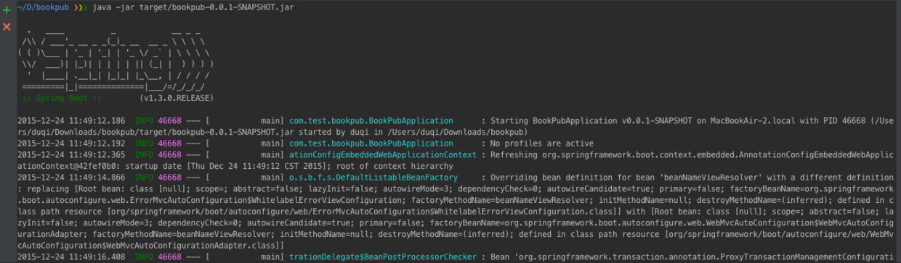

# Spring Boot应用的打包和部署

现在的IT开发，[DevOps](http://www.infoq.com/cn/devops/)渐渐获得技术管理人员支持、云计算从ECS转向Docker容器技术、微服务的概念和讨论也越来越热，以上这些研究方面，最终都聚焦于软件的打包、分发和部署上。

[Twelve-Factor App]开发方法这一系列的博文主要讲述了一个现代的SaaS应用是如何被构建和部署的，其中一个关键的原则是：分离配置定义和应用程序。

DevOps开发模型要求开发人员管理应用程序的开发、测试、打包和部署等所有流程，当然，必须确保这些步骤的执行足够简单和可控，否则开发人员都没有时间维护软件和开发新功能了。要实现DevOps模型，需要简洁、隔离的应用程序包，这种应用程序自带运行容器、可以当做进程一样一键运行，并且不需要重新构建就部署到不同的机器上。

## 一、创建基于Spring Boot框架的可执行Jar包

Spring Boot开发的应用可以打包为单独的JAR包，然后通过`java -jar <name>.jar`命令运行。接下来我们基于之前练习使用的应用程序，看看如何构建Spring Boot Uber JAR。

> Note：[Uber JAR](http://stackoverflow.com/questions/11947037/what-is-an-uber-jar)是将应用程序打包到单独的jar包中，该jar包包含了应用程序依赖的所有库和二进制包。

### How Do

- 通过`mvn clean package`命令打包应用程序
- 通过命令`java -jar target/bookpub-0.0.1-SNAPSHOT.jar`运行程序

### 分析

如上所示，打包成可执行的jar包这种方法相当直观，背后的工作由spring-boot-maven-plugin插件实现：先通过maven-shade-plugin生成一个包含依赖的jar，再通过spring-boot-maven-plugin插件把spring boot loader相关的类，还有MANIFEST.MF打包到jar里。关于Spring Boot的启动原理分析，详见[spring boot应用启动原理分析](http://blog.csdn.net/hengyunabc/article/details/50120001#t0)一文。

>总结下Spring Boot应用的启动流程：（1）spring boot应用打包之后，生成一个fat jar，里面包含了应用依赖的jar包，还有Spring boot loader相关的类；（2）Fat jar的启动Main函数是JarLauncher，它负责创建一个LaunchedURLClassLoader来加载/lib下面的jar，并以一个新线程启动应用的Main函数。

## 二、创建Docker镜像

可以参考我之前写的一篇文章：[Docker with Spring Boot](http://www.jianshu.com/p/6a1b06ab8734)
