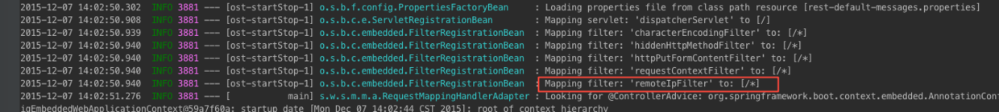

# Spring Boot：定制servlet filters

在实际的web应用程序中，经常需要在请求（request）外面增加包装用于：记录调用日志、排除有XSS威胁的字符、执行权限验证等等。除了上述提到的之外，Spring Boot自动添加了OrderedCharacterEncodingFilter和HiddenHttpMethodFilter，并且我们在自己的项目中还可以增加别的过滤器。

Spring Boot、Spring Web和Spring MVC等其他框架，都提供了很多servlet 过滤器可使用，我们需要在配置文件中定义这些过滤器为bean对象。现在假设我们的应用程序运行在一台负载均衡代理服务器后方，因此需要将代理服务器发来的请求包含的IP地址转换成真正的用户IP。Tomcat 8 提供了对应的过滤器：**RemoteIpFilter**。通过将RemoteFilter这个过滤器加入过滤器调用链即可使用它。

## How Do

一般在写简单的例子时，不需要单独定义配置文件，只需要将对应的bean对象定义在Application类中即可。正式的项目中一般会有单独的web配置文件，我们在项目的`com.test.bookpub`（与BookpubApplication.java同级）下建立WebConfiguration.java文件，并用@Configuration注解修饰。

```
package com.test.bookpub;

import org.apache.catalina.filters.RemoteIpFilter;
import org.springframework.context.annotation.Bean;
import org.springframework.context.annotation.Configuration;

@Configuration
public class WebApplication {
    @Bean
    public RemoteIpFilter remoteIpFilter() {
        return new RemoteIpFilter();
    }
}
```

通过`mvn spring-boot:run`启动项目，可以在终端中看到如下的输出信息，证明RemoteIPFilter已经添加成功。



## 分析

项目的主类——BookPubApplication，可以看到由@SpringBootApplication注解修饰，这包含了@ComponentScan、@Configuration和@EnableAutoConfiguration注解。在[Spring Boot的自动配置、Command-line Runner](spring-boot-autoconfig.md)一文中曾对这个三个注解做详细解释，@ComponentScan让Spring Boot扫描到WebConfiguration类并把它加入到程序上下文中，因此，我们在WebApplication中定义的Bean就跟在BookPubApplication中定义一样。

方法`@Bean    public RemoteIpFilter remoteIpFilter() { ... }`返回一个RemoteIPFilter类的spring bean。当Spring Boot监测到有javax.servlet.Filter的bean时就会自动加入过滤器调用链。从上图中还可以看到，该Spring Boot项目一次加入了这几个过滤器：characterEncodingFilter（用于处理编码问题）、hiddenHttpMethodFilter（隐藏HTTP函数）、httpPutFormContentFilter、requestContextFilter（请求上下文），以及我们刚才自定义的RemoteIPFilter。

所有过滤器的调用顺序跟添加的顺序相反，过滤器的实现是**责任链模式**，具体的原理分析可以参考：[责任链模式](http://www.cnblogs.com/wxisme/p/4550712.html)
