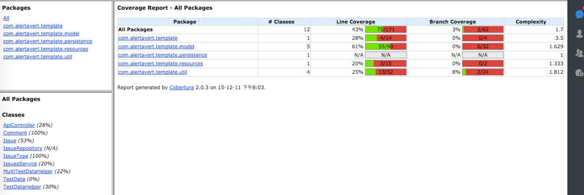
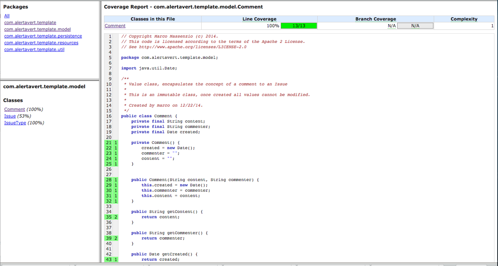

# Spring Boot应用的测试——Mockito

Spring Boot可以和大部分流行的测试框架协同工作：通过Spring JUnit创建单元测试；生成测试数据初始化数据库用于测试；Spring Boot可以跟BDD（Behavier Driven Development）工具、Cucumber和Spock协同工作，对应用程序进行测试。

进行软件开发的时候，我们会写很多代码，不过，再过六个月（甚至一年以上）你知道自己的代码怎么运作么？通过测试（单元测试、集成测试、接口测试）可以保证系统的可维护性，当我们修改了某些代码时，通过回归测试可以检查是否引入了新的bug。总得来说，测试让系统不再是一个黑盒子，让开发人员确认系统可用。

在web应用程序中，对Controller层的测试一般有两种方法：（1）发送http请求；（2）模拟http请求对象。第一种方法需要配置回归环境，通过修改代码统计的策略来计算覆盖率；第二种方法是比较正规的思路，但是在我目前经历过的项目中用得不多，今天总结下如何用Mock对象测试Controller层的代码。

在之前的几篇文章中，我们都使用bookpub这个应用程序作为例子，今天也不例外，准备测试它提供的RESTful接口是否能返回正确的响应数据。这种测试不同于**单元测试**，需要为之初始化完整的应用程序上下文、所有的spring bean都织入以及数据库中需要有测试数据，一般来说这种测试称之为**集成测试**或者**接口测试**。

## How Do

通过spirng.io新建的Spring Boot项目提供了一个空的测试文件——*BookPubApplicationTest.java*，内容是：

```
@RunWith(SpringJUnit4ClassRunner.class)
@SpringApplicationConfiguration(classes = BookPubApplication.class)
public class BookPubApplicationTests {
   @Test
   public void contextLoads() {
   }
}
```

- 在pom文件中增加*spring-boot-starter-test*依赖，添加jsonPath依赖

```
<dependency>
   <groupId>org.springframework.boot</groupId>
   <artifactId>spring-boot-starter-test</artifactId>
   <scope>test</scope>
</dependency>
<dependency>
   <groupId>com.jayway.jsonpath</groupId>
   <artifactId>json-path</artifactId>
</dependency>
```

- 在BookPubApplicationTest中添加测试用例

```
package com.test.bookpub;

import com.test.bookpub.domain.Book;
import com.test.bookpub.repository.BookRepository;
import org.junit.Before;import org.junit.Test;
import org.junit.runner.RunWith;
import org.springframework.beans.factory.annotation.Autowired;
import org.springframework.beans.factory.annotation.Value;
import org.springframework.boot.test.SpringApplicationConfiguration;
import org.springframework.boot.test.TestRestTemplate;
import org.springframework.boot.test.WebIntegrationTest;
import org.springframework.http.MediaType;
import org.springframework.test.context.junit4.SpringJUnit4ClassRunner;
import org.springframework.test.web.servlet.MockMvc;
import org.springframework.test.web.servlet.setup.MockMvcBuilders;
import org.springframework.web.client.RestTemplate;
import org.springframework.web.context.WebApplicationContext;
import static org.junit.Assert.assertEquals;
import static org.junit.Assert.assertNotNull;
import static org.hamcrest.Matchers.containsString;
import static org.springframework.test.web.servlet.request.MockMvcRequestBuilders.get;
import static org.springframework.test.web.servlet.result.MockMvcResultMatchers.content;
import static org.springframework.test.web.servlet.result.MockMvcResultMatchers.jsonPath;
import static org.springframework.test.web.servlet.result.MockMvcResultMatchers.status;

@RunWith(SpringJUnit4ClassRunner.class)
@SpringApplicationConfiguration(classes = BookPubApplication.class)
@WebIntegrationTest("server.port:0")
public class BookPubApplicationTests {
    @Autowired
    private WebApplicationContext context;
    @Autowired
    private BookRepository bookRepository;
    @Value("${local.server.port}")
    private int port;

    private MockMvc mockMvc;
    private RestTemplate restTemplate = new TestRestTemplate();

    @Before
    public void setupMockMvc() {
        mockMvc = MockMvcBuilders.webAppContextSetup(context).build();
    }

   @Test
   public void contextLoads() {
        assertEquals(1, bookRepository.count());
   }

    @Test
    public void webappBookIsbnApi() {
        Book book = restTemplate.getForObject("http://localhost:" + port +"/books/9876-5432-1111", Book.class);
        assertNotNull(book);
        assertEquals("中文测试", book.getPublisher().getName());
    }

    @Test
    public void webappPublisherApi() throws Exception {
        //MockHttpServletRequestBuilder.accept方法是设置客户端可识别的内容类型
        //MockHttpServletRequestBuilder.contentType,设置请求头中的Content-Type字段,表示请求体的内容类型
        mockMvc.perform(get("/publishers/1")
                .accept(MediaType.APPLICATION_JSON_UTF8))

                .andExpect(status().isOk()) 
               .andExpect(content().string(containsString("中文测试")))
                .andExpect(jsonPath("$.name").value("中文测试"));
    }
}
```

- spring boot项目的代码覆盖率
使用cobertura，参考项目的github地址：[spring boot template](https://github.com/duqicauc/spring-template)

```
# To create test coverage reports (in target/site/cobertura)
mvn clean cobertura:cobertura test
```



## 分析

首先分析在*BookPubApplicationTests*类中用到的注解：

- *@RunWith(SpringJUnit4ClassRunner.class)*，这是JUnit的注解，通过这个注解让*SpringJUnit4ClassRunner*这个类提供Spring测试上下文。
- *@SpringApplicationConfiguration(classes = BookPubApplication.class)*，这是Spring Boot注解，为了进行集成测试，需要通过这个注解加载和配置Spring应用上下文。这是一个元注解（meta-annoation），它包含了*@ContextConfiguration(    loader = SpringApplicationContextLoader.class)*这个注解，测试框架通过这个注解使用Spring Boot框架的*SpringApplicationContextLoader*加载器创建应用上下文。
- *@WebIntegrationTest("server.port:0")*，这个注解表示当前的测试是集成测试（integration test），因此需要初始化完整的上下文并启动应用程序。这个注解一般和*@SpringApplicationConfiguration*一起出现。*server.port:0*指的是让Spring Boot在随机端口上启动Tomcat服务，随后在测试中程序通过*@Value("${local.server.port}")*获得这个端口号，并赋值给port变量。当在Jenkins或其他持续集成服务器上运行测试程序时，这种随机获取端口的能力可以提供测试程序的并行性。

了解完测试类的注解，再看看测试类的内部。由于这是Spring Boot的测试，因此我们可通过@Autowired注解织入任何由Spring管理的对象，或者是通过@Value设置指定的环境变量的值。在现在这个测试类中，我们定义了*WebApplicationContext*和*BookRepository*对象。

每个测试用例用@Test注解修饰。在第一个测试用例——contextLoads()方法中，我仅仅需要确认*BookRepository*连接已经建立，并且数据库中已经包含了对应的测试数据。

第二个测试用例用来测试我们提供的RESTful URL——通过ISBN查询一本书，即“/books/{isbn}”。在这个测试用例中我们使用*TestRestTemplate*对象发起RESTful请求。

第三个测试用例中展示了如何通过*MockMvc*对象实现跟第二个测试类似的功能。Spring测试框架提供MockMvc对象，可以在不需要客户端-服务端请求的情况下进行MVC测试，完全在服务端这边就可以执行Controller的请求，跟启动了测试服务器一样。

测试开始之前需要建立测试环境，setup方法被@Before修饰。通过*MockMvcBuilders*工具，使用WebApplicationContext对象作为参数，创建一个MockMvc对象。

MockMvc对象提供一组工具函数用来执行assert判断，都是针对web请求的判断。这组工具的使用方式是函数的链式调用，允许程序员将多个测试用例链接在一起，并进行多个判断。在这个例子中我们用到下面的一些工具函数：

- *perform(get(...))*建立web请求。在我们的第三个用例中，通过*MockMvcRequestBuilder*执行GET请求。
- *andExpect(...)*可以在perform(...)函数调用后多次调用，表示对多个条件的判断，这个函数的参数类型是*ResultMatcher*接口，在*MockMvcResultMatchers*这这个类中提供了很多返回*ResultMatcher*接口的工具函数。这个函数使得可以检测同一个web请求的多个方面，包括HTTP响应状态码（response status），响应的内容类型（content type），会话中存放的值，检验重定向、model或者header的内容等等。这里需要通过第三方库*json-path*检测JSON格式的响应数据：检查json数据包含正确的元素类型和对应的值，例如*jsonPath("$.name").value("中文测试")*用于检查在根目录下有一个名为name的节点，并且该节点对应的值是“中文测试”。

## 一个字符乱码问题

- 问题描述：通过*spring-boot-starter-data-rest*建立的repository，取出的汉字是乱码。

- 分析：使用postman和httpie验证都没问题，说明是Mockmvc的测试用例写得不对，应该主动设置客户端如何解析HTTP响应，用get.accept方法设置客户端可识别的内容类型，修改后的测试用例如下：

```
@Test
public void webappPublisherApi() throws Exception {
    //MockHttpServletRequestBuilder.accept方法是设置客户端可识别的内容类型
    //MockHttpServletRequestBuilder.contentType,设置请求头中的Content-Type字段,表示请求体的内容类型
    mockMvc.perform(get("/publishers/1")
            .accept(MediaType.APPLICATION_JSON_UTF8))

            .andExpect(status().isOk())
            .andExpect(content().string(containsString("中文测试")))
            .andExpect(jsonPath("$.name").value("中文测试"));
}
```

## 参考资料

1. [基于Spring-WS的Restful API的集成测试](http://ningandjiao.iteye.com/blog/1982635)
2. [J2EE要懂的小事—图解HTTP协议](http://www.bysocket.com/?p=282)
3. [Integration Testing a Spring Boot Application](http://www.jayway.com/2014/07/04/integration-testing-a-spring-boot-application/)
4. [spring boot project template](http://codetrips.com/2014/12/24/spring-boot-template-project/)
